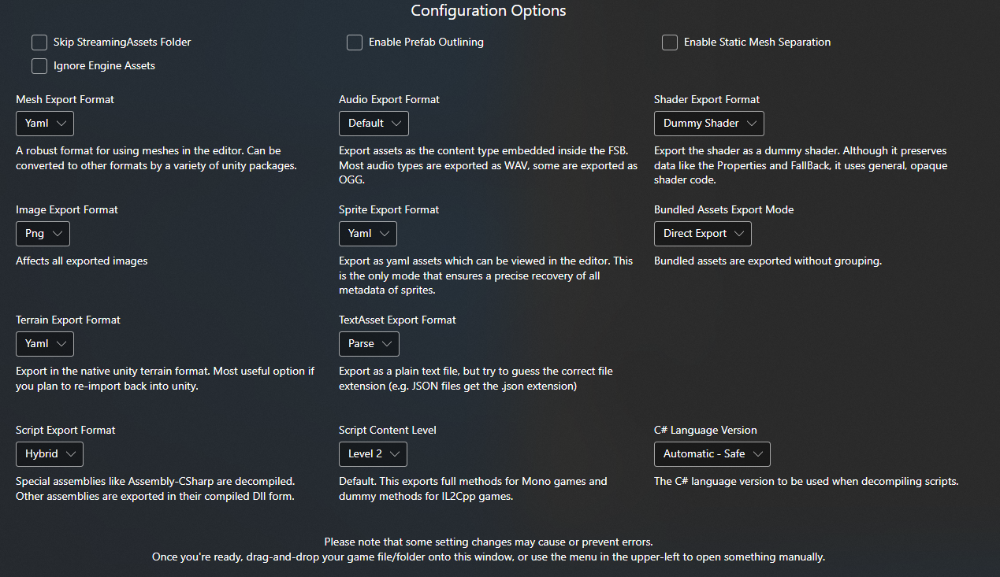
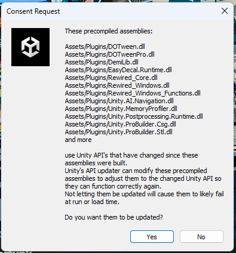

# BRC Modding notes, research, experiments

See also: the wiki https://github.com/cspotcode/bomb-rush-cyberfunk-modding/wiki/

# Skate around in Unity Editor

Instructions for loading a map in Unity's editor and skating around.  This research may be useful for other modders working on
tools for custom map authors.

## Install Prerequisites

### Unity

Download and install Unity version from here:
https://unity.com/releases/editor/whats-new/2021.3.27

You do not need to include any addons, such as Android or Linux export.

<!--
Launch the Unity editor.  *We don't have a project yet!*  That's ok, we are going to install some addons first.  EDIT: Unity Hub makes this annoying, you cannot launch Unity without first creating an empty project.  So that's what I did: create an empty project, open it.

Window -> Package Manager

At top, click "Packages" and toggle it to "Packages: Unity Registry"
-->

### AssetRipper

Download AssetRipper from here:
https://assetripper.github.io/AssetRipper/articles/Downloads.html

### Beyond Compare

Install Beyond Compare from here:
https://www.scootersoftware.com/download

## Rip game assets

Launch AssetRipper.

Use default settings.  Here's an image of them for reference:



File -> Open Folder

Choose root directory of your Steam installation of BRC.

Export -> Export all files

*Optional: create a .zip backup of all the ripped files.  That way, if you break something, you can restart from the zip instead
of running AssetRipper again.*

## Configure Unity project

Now we open our newly-ripped game assets in Unity.

Open Unity Hub

Open -> Add Project from disk

Find where you extracted from AssetRipper, open the `Bomb Rush Cyberfunk/ExportedProject` subdirectory.

Unity will take a long time to import assets the first time.  *It will also show error popups!*  This is normal.

When you get the "Consent Request" about modifying precompiled assemblies to match new Unity APIs, choose "Yes"



When you get a prompt to enter safe mode due to compilation errors, choose "Enter Safe Mode."

Install missing packages to resolve the errors.

Window -> Package Manager

At top, click "Packages" and toggle it to "Packages: Unity Registry"

Search for and install "Unity UI."

If you'll be editing code, also install "Visual Studio Editor" *and* "Visual Studio Code Editor." *If you use Visual Studio Code, you must install both of them!*

### Optional

Edit -> Preferences, External Tools, choose "Visual Studio Code"

Install VSCode

In VSCode, install "Unity" extension, which allows attaching a debugger.  This one: https://marketplace.visualstudio.com/items?itemName=VisualStudioToolsForUnity.vstuc
<!-- TODO where's the button to enable debug assemblies by default? -->

## Delete shaders that mess up Unity Editor

Delete these two shaders, they mess up the appearance of Unity's UI:

```
Assets/Shader/Hidden_UIElements_EditorUIE.shader
Assets/Shader/Hidden_UIElements_EditorUIE_0.shader
```

## Patch code

Patch file is [patch.patch](./patch.patch)
Apply those code changes to the `Scripts` subdirectory.

TODO explain this better, tools can apply the patch automatically.

## Create `SkateInEditor` scene

We need to load one additional `MonoBehaviour` to complete the bootstrapping process.

Make a new Scene `SkateInEditor` with a single empty gameobject with the `SkateInEditor` script attached.

*We could alternatively add this GameObject to the core or Bootstrap scenes, but I like to avoid modifying them*

## Open scenes

Search for and open all these scenes in the editor:

- `core`
- `Bootstrap`
- `SkateInEditor` (we created this one above)
- `hideout`

## Press play

---

<!--
## Generating the patch

If you have a pristine (unmodified) rip from AssetRipper alongside your modified rip, you can use a diffing tool to see
which scripts were modified.

In Beyond Compare 4, choose folder compare, compare the Assets/Scripts directories, and for "Filters" put: `-*.meta`
-->

## Problems

Going into and out of play mode is slow.  Any way we can optimize?

Does not load a save file from disk.  Good because it doesn't corrupt your saves, bad if you want things to be unlocked.
Some of our code unlocks things, can we add more code to unlock everything automatically?
